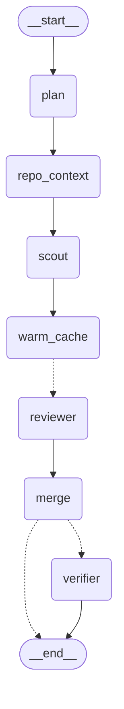

# RC1-391 — The multi-agent review on LangGraph: spike record

The last step of the multi-agent sequence (RC1-387 → RC1-390 → RC1-393 →
RC1-394 → RC1-391). The graph the earlier stories built in plain Python is
ported, unchanged, to LangGraph on a branch and the two are measured
against each other. The point was exposure to an orchestration framework
and a controlled comparison, not adoption; the ticket said "the framework
added a dependency and cost us cache hits for no quality change" would be
a valid finding, and so would the opposite.

- **Ticket:** [RC1-391](https://hirereidcollins.atlassian.net/browse/RC1-391)
- **Flag:** `REVIEW_ORCHESTRATOR` — `asyncio` (default, `app/agent/multi.py`)
  or `langgraph` (`app/agent/graph.py`); meaningful only with
  `REVIEW_MULTI_AGENT` on
- **Code:** `app/agent/graph.py`, `tests/test_graph.py`,
  `scripts/measure_pr.py`; `langgraph` in `requirements-dev.txt` only
- **Runs (all 2026-09-07 UTC, `claude-sonnet-4-6`, verifier on, checkout):**
  asyncio `pr-review-20260907T003322.038287Z`; LangGraph
  `pr-review-20260907T010242.676311Z`; LangGraph with ddtrace's LangGraph
  integration on `pr-review-20260907T013708.630775Z`; RC1-394's run E
  `pr-review-20260906T174937.074340Z` for the run-to-run band

## Context

The ticket names the three conditions under which a framework earns its
place: the graph is dynamic (the model chooses the next step), a run has to
pause and resume, or a human has to approve a step mid-run. The PR review
is none of those. It is a fixed fan-out and fan-in that finishes in one shot
from a webhook, which RC1-390 wrote in about forty lines of `asyncio`. That
is what makes the comparison fair: the framework has to justify itself on
something other than necessity.

The graph ported is the review as RC1-394 left it, not as RC1-390 built
it: on a repository with a conventions file the context is complete, the
scout is skipped, and a review is one prefix write plus four cached reads.
So the scout node exists and is tested, but on every measurement in this
record it ran no model turn — the same as production.

## What was built

**The graph** (`app/agent/graph.py`). A LangGraph `StateGraph` with seven
nodes and the edges the asyncio version implied with `await`:



The drawing is `graph.mermaid()`, which is `build_graph().get_graph().draw_mermaid()`
— the framework draws it from the edge list.

**State versus context.** LangGraph wants the run's state as a typed
record with reducers for the keys several nodes write. The state here is
the review record as it accumulates — plan, context, brief, prefix, warm
usage, the reviewers' outputs, the result — and nothing else. The run's
dependencies (the PR, the checkout, the sync and async clients, the knobs)
go in LangGraph's runtime `context`, a dataclass every node reads from
`runtime.context`. That split was forced by the framework — a checkpoint
should not have to serialize an HTTP client — and it is a cleaner seam than
the asyncio version's argument list.

**The fan-out is `Send`.** The edge out of `warm_cache` returns one
`Send("reviewer", {spec, prefix})` per planned reviewer. LangGraph runs
them as one superstep and `merge` runs in the next, after every reviewer
has appended to `outputs` (an `operator.add` reducer). The asyncio
version's ordering — warm first, then `gather`, then merge — is the edge
list here; the same three cache facts hold because the same order holds.
`merge` sorts the outputs back into plan order, because the reducer's order
is the order the framework applied the writes, and the record's order is
the plan's.

**Nodes call the Anthropic SDK directly**, through the request builders and
parsers `multi.py` already has (`_request`, `_warm_cache`,
`_run_reviewer`, `merge_findings`, `compose_summary`). The LangChain model
wrapper, `langchain-anthropic`, was tried in a dry-run install and
rejected: it pins `anthropic==1.4.0` where the app runs `0.109.1`, a major
version apart, and it would put an abstraction between the review and its
`cache_control` breakpoints. With the calls held constant the graph is the
only thing under test — and the ticket's worry, that cache placement would
take more care under a framework, is answered by construction: the parity
test feeds identical scripted fakes to both engines and asserts the
recorded requests are equal, byte for byte, warm call to verifier.

**Compiled once.** `default_graph()` is an `lru_cache`d compile (3.9 ms);
the eval's sixteen cases and the webhook's reviews share one. A caller can
pass its own compiled graph with a checkpointer, which is how the
interrupt test works.

**Dev-only dependency.** `langgraph` is in `requirements-dev.txt`, not
`requirements.txt`. `graph.py` is imported only when the flag names it, so
the runtime image and the flag-off request shape are untouched. Setting
the flag in production without the package would fail at review time with
an `ImportError`; that is acceptable for a spike and would move to the
runtime file on adoption.

**The pricing harness** that RC1-393 and RC1-394 each rebuilt from a
memory note is now `scripts/measure_pr.py`: a worktree at the PR's head
SHA, the shipped `review_pull_request` with the flags asked for,
`app.pricing.review_cost` over the result, one JSON line per review.

**Tests** (`tests/test_graph.py`, 12): parity on requests and record with
and without the verifier; plan-order output regardless of scheduler order;
docs-only routing; an explicit plan; a complete context skipping the scout;
precomputed findings reaching the scout and the prefix; the graph drawing
itself; interrupt before the verifier, inspect the state, resume; dispatch
on the setting; the setting's validator; the eval's subject version naming
the orchestrator. 476 tests, 95 % coverage.

## Method

Same model, verifier on, the same evening, in this order so that no run
could read another's prompt cache (the API's cache lives five minutes): the
corpus on asyncio at 00:28, the three live PRs on asyncio at 00:34, the
corpus on LangGraph at 00:56, the three PRs on LangGraph at 01:02. The
check that this held is in the records: the warm call wrote the prefix on
16 of 16 cases in both runs, and the only cache read on any warm call is
the shared system block (2,019 tokens, the same in every review).

- *The corpus with a checkout*: `python -m evals --repo-path .`, both
  engines, sixteen cases each. Run E from RC1-394 (same code, same
  configuration, six hours earlier) is the third column, so the difference
  between two runs of the *same* engine is visible next to the difference
  between engines.
- *Live PRs at their own heads*: `scripts/measure_pr.py 35 33 39 --multi
  --verify`, both engines.
- *Framework overhead offline*: thirty reviews per engine on the scripted
  fakes, so the number is the framework's and not the network's.
- *Trace shape*: a ddtrace `TraceFilter` recording every span one offline
  review produces under LLM Observability, per engine, with and without
  ddtrace's LangGraph integration.
- *Dependencies*: `pip install --dry-run --report`.

## Results

### The corpus, three ways

| | E (RC1-394, asyncio, 17:49) | asyncio, 00:33 | **LangGraph, 01:02** |
| --- | --- | --- | --- |
| Cases passing | 13 / 16 | 12 / 16 | 13 / 16 |
| Recall | 13 / 13 | 13 / 13 | **13 / 13** |
| Categorized correctly | 11 / 13 | 10 / 13 | 11 / 13 |
| Severity floor met | 13 / 13 | 13 / 13 | 13 / 13 |
| Precision | 1 / 2 | 1 / 2 | 1 / 2 |
| Clean diff | 1 nit | 0 | 1 nit |
| Verifier dropped / downgraded | 19 / 4 | 19 / 5 | 17 / 6 |
| Merge folded / off-scope | 2 / 3 | 1 / 2 | 2 / 1 |
| Cost | $0.705 | $0.709 | **$0.705** |
| Cost per case, mean / median | 4.4 ¢ / 4.3 ¢ | 4.4 ¢ / 4.3 ¢ | 4.4 ¢ / 4.4 ¢ |
| Reviewer cache reads, sum of tokens | 223,446 | 222,438 | 221,430 |
| Cache writes, sum of tokens | 44,197 | 43,861 | 43,525 |
| Every reviewer read the prefix from cache | 16 / 16 | 16 / 16 | **16 / 16** |
| Smallest reviewer cache read, any case | 4,457 | 4,436 | 4,415 |
| Wall clock per case, median | 16.7 s | 17.7 s | 18.9 s |
| Wall clock per case, range | 12–23 s | 7–26 s | 11–41 s |
| Fan-out stage, median | 12.8 s | 12.5 s | 13.2 s |
| Verifier stage, median | 4.3 s | 5.0 s | 4.6 s |
| Framework overhead per case, median | — | — | 10 ms |

Cost and cache behaviour are the same to four significant figures, which is
what identical requests should produce. The quality columns differ by one
case here and there, and the middle column says how much of that is the
engine: two runs of the *same* asyncio code six hours apart differ by one
categorization miss (`convention-break` flipped, `unpinned-dependency`
flipped the other way), one clean-diff nit and two verifier verdicts. The
LangGraph run sits inside that band on every row. The categorization misses
are the ones every multi-agent run has had — the right defect filed under a
neighbouring category surviving the verifier — and they move between runs
of either engine.

Latency: the LangGraph run's median is 1.2 s slower and its range wider.
One case explains the range: `n8n-hot-cron` took 40.6 s against 19.7 s, a
21 s verifier call. The framework's own share, measured as the wall clock
the stages did not account for, is 10 ms per case.

### Live PRs of this repository

| PR | Engine | Cost | Wall | Fan-out | Verifier | Overhead | Findings | Smallest reviewer cache read |
| --- | --- | --- | --- | --- | --- | --- | --- | --- |
| #35, 6 files, +161/−10 | asyncio | 6.6 ¢ | 18.6 s | 14.0 s | 4.3 s | — | 2 nits | 9,659 |
| | **LangGraph** | **5.7 ¢** | 17.4 s | 13.2 s | 3.6 s | 7 ms | 0 | 9,659 |
| #33, 10 files, +666/−81 | asyncio | 12.7 ¢ | 25.7 s | 17.0 s | 8.6 s | — | 1 warning, 4 nits | 18,603 |
| | **LangGraph** | **13.6 ¢** | 162.8 s | 40.2 s | 122.5 s | 13 ms | 1 warning, 3 nits | 18,603 |
| #39, 27 files, +2,168/−35 | asyncio | 20.4 ¢ | 54.5 s | 44.5 s | 9.9 s | — | 1 warning, 3 nits | 22,823 |
| | **LangGraph** | **20.6 ¢** | 51.2 s | 42.9 s | 8.2 s | 8 ms | 3 nits | 22,823 |

The prefix each engine wrote was the same size on every PR: the warm call
wrote 7,640, 16,584 and 20,804 tokens under both engines, and every
reviewer read 9,659, 18,603 and 22,823 from cache. The one warm-call
difference is #39 under LangGraph, where the shared system block was not
served from cache that time (`cache_read=0` against 2,019 on the other
five reviews), so the warm call wrote it too — 0.7 ¢ of the 8.57 ¢. That is
the API's cache, not the graph. The rest of the cost differences are the
reviewers' output lengths. #35's two runs found 2 nits and 0 — RC1-394 saw
the same PR produce 0 and 2 on two asyncio runs. #33 on LangGraph took
162.8 s because the verifier call took 122 s; RC1-394 recorded a 136 s
verifier call on #35 under asyncio. That is the API, not the graph; the
framework's share on the same review was 13 ms.

### Framework overhead, offline

Thirty reviews per engine on the scripted fakes, so every model call
returns instantly and the wall clock is the orchestration's:

| | Median | p90 |
| --- | --- | --- |
| asyncio (`multi.py`) | 0.6 ms | 0.6 ms |
| LangGraph, compiled once | 2.8 ms | 3.2 ms |
| LangGraph, compiled per review | 6.7 ms | 7.2 ms |

Compiling the graph costs 3.9 ms; the `graph_overhead` figure the record
carries (the run minus its stages) is 1.7–1.9 ms offline and 7–13 ms on the
live PRs, where it also includes `asyncio.run` and closing the client. On
a review that takes 10–60 s the framework is under a tenth of a percent.

### Trace shape

Recorded with a ddtrace trace filter on one offline review per engine.
The asyncio engine, and LangGraph with ddtrace's LangGraph integration left
off (the app's own default: `observability.py` env-defaults every
non-Anthropic integration off), produce the same tree — one root, eight
spans:

```
workflow pr_review
  task  repo_context
  agent scout
  task  warm_cache
  agent reviewer.diff_local
  agent reviewer.repo_context
  agent reviewer.change_intent
  agent verifier
```

With `DD_TRACE_LANGGRAPH_ENABLED=true` the same review is eighteen spans
under the same root: one `langgraph.request` span for the compiled graph
and one per node task (the `reviewer` node three times, once per `Send`),
with the hand-built stage spans nested inside their node's span. It is a
faithful picture of the graph, and it is the same information twice. The
Datadog UI was not eyeballed for either — the trace explorer never reached
idle for the Chrome extension, as RC1-394 found with the dashboard page —
so the tree above is the recorded one, not a screenshot.

### The run that hung

The first LangGraph corpus run, with the ddtrace LangGraph integration on
for the trace question, did not finish. After 19 minutes (the asyncio run
takes five) the process had used 2 s of CPU; a stack sample showed the main
thread parked in the event loop's `kevent`, the loop's two executor threads
idle on their work queue, and nine established connections to the API. It
was killed. The same configuration on a single diff-only case then
completed in 12 s, and a second full corpus run in the same configuration
is recorded below. What the sample could not say is *which* await never
resolved: the stack under `asyncio.run` is the framework's, and a hang
inside a Pregel superstep has no Python frame of this repository's to name.

The second run, `pr-review-20260907T013708.630775Z`, same configuration,
finished in 5 min 9 s: 13 / 13 recall, 12 / 13 categorized (the best of the
evening's four runs), 1 / 2 precision, no blocker on the clean diff,
$0.699, median 19.3 s per case, every reviewer reading the prefix from
cache, framework overhead 6 ms per case. So the hang is one run in two
under the integration and none in two without it — one occurrence, not a
reproduction, and not enough to blame the integration rather than a stalled
connection the SDK's 180 s timeout should have ended and did not. It is
recorded here as what it is: a run that stopped inside the framework with
nothing in the sample to name, on the one configuration that adds ten
spans per review. The asyncio version has run the corpus six times across
four stories — 96 cases — without one.

### Dependencies

| | Runtime (`requirements.txt`) | Dev (`requirements-dev.txt`) |
| --- | --- | --- |
| Direct dependencies before | 9 | 9 + 4 |
| Added by this spike | 0 | 1 (`langgraph`) |
| Distributions installed by that one line | — | 22, 26.9 MB |
| Among them | — | `langchain-core`, `langsmith`, `langgraph-checkpoint`, `langgraph-sdk`, `orjson`, `ormsgpack`, `requests` and its four, `tenacity`, `xxhash`, `zstandard`, a second `httpx` |
| The LangChain model wrapper would add | — | 2 more, and replace `anthropic 0.109.1` with `1.4.0` |

The venv went from 50 distributions to 72. One of the new ones starts a
Rust runtime thread (`tokio-rt-worker`) in every process that imports the
graph module, whether or not LangSmith tracing is on.

## What the framework gave, and what it took

**Gave.**

- *The graph is declared, not implied.* `multi.py`'s order lives in the
  sequence of `await`s and one `gather`; `graph.py`'s lives in nine
  `add_edge` lines and draws itself. For three reviewers the difference is
  readability; for thirty nodes it would be the difference between a design
  and an archaeology.
- *Pause and resume, in thirty lines.* `build_graph(checkpointer=InMemorySaver(),
  interrupt_before=["verifier"])` stops the review with the merged findings
  in the checkpoint; `get_state(config)` shows `next == ("verifier",)`;
  `ainvoke(None, config)` resumes and the verifier runs on the same state.
  The test does exactly this. The review record — dataclasses all the way
  down — serialized without help. This is the ticket's second condition,
  and it is real: a human-approval step before posting would be one
  `interrupt_before` and a durable checkpointer.
- *Per-node policy for free.* `retry_policy`, `timeout`, `cache_policy` and
  an `error_handler` are keyword arguments on `add_node`. Not used here:
  the SDK client already retries transport errors, and LangGraph's
  `default_retry_on` would retry an Anthropic 400 (its allow-list is
  `httpx`/`requests` exceptions; anything else is retried), so a real
  policy would need writing. The place is there.
- *A forced seam.* State versus runtime context made the review's inputs
  and its record two separate types, which `multi.py` blurs into one
  argument list.

**Took.**

- *Twenty-two packages* for what `asyncio.gather` did, including a Rust
  runtime and a tracing client for a service this estate does not use.
- *A second scheduler to reason about.* Sync nodes (`scout`, `verifier`)
  run in the loop's default executor under `ainvoke`; the stage spans still
  nest because contextvars are copied to the worker, but that is a fact to
  know, not one the code states. The reducer's write order is the
  framework's, so `merge` re-sorts. The `Send` payload and the node's input
  schema are a convention, not a type check.
- *A hang whose stack is not ours.* One LangGraph corpus run in three
  stopped inside the framework with nothing in the sample to name the
  await; the rerun in the same configuration finished. Not reproduced, not
  explained, and the stack under `asyncio.run` belongs to the framework —
  which is the debuggability cost the ticket asked about, seen once.
- *Twice the spans* if its Datadog integration is on — the same tree the
  hand-built stage spans already draw, nested one level deeper; the fleet
  dashboard's widgets read the `pr_review` root and would not care, but a
  reader of the trace would see every node twice.
- *A pin conflict waiting.* Using the framework the way its documentation
  does — through `langchain-anthropic` — means a different major of the
  Anthropic SDK than the app runs. The port avoided it by calling the SDK
  directly, which also means the framework contributed orchestration only.
- *Cache placement: unchanged*, but only because the model wrapper was
  refused. That is the ticket's worry answered by not taking the option,
  not by the framework handling it.

## Decision

**Production stays on `asyncio`.** Same cost to the cent, same cache
behaviour to the token, quality inside the run-to-run band, 2 ms of
overhead against 22 packages, and one unexplained hang in three corpus
runs. The ticket's three conditions did not apply before the spike and
still do not.

**The branch merges, flag default `asyncio`, dependency dev-only.** The
module is the exhibit the ticket asked for and the parity test is what
keeps it honest: it fails the moment `multi.py` changes a request and
`graph.py` does not. That is the maintenance cost — every change to the
asyncio graph is mirrored or the test is deleted — and it is bounded: if
mirroring ever costs more than an hour, delete `graph.py`, its test and
the dev pin, and keep this record. Reid's call at review.

**Pydantic AI, the optional second port, was not done.** The LangGraph
result was "identical by construction"; a second framework would show the
same numbers for the same reason, and the interesting differences (typed
state, a lighter dependency tree) are readable from its documentation
without another $1.50 of corpus.

**When I would reach for this** — the paragraph the ticket asked for, to
say out loud: *I would reach for LangGraph when the graph is something I
cannot write down in advance — when the model decides the next step, when
a run has to survive the process that started it, or when a person has to
approve a step in the middle. I ported a fixed three-reviewer fan-out to
it and measured no change in cost, cache hits or findings, 2 ms of
overhead, and 22 packages; the pause-and-resume worked in thirty lines and
was the one thing plain Python could not do as cheaply. For a review that
finishes in under a minute from a webhook, forty lines of `asyncio` with
the cache breakpoints under my own control is the right tool, and I have
the numbers to say so rather than an opinion.*

## Follow-ups

- Cross-category dedupe, deferred from RC1-394, is still open. This
  record's three runs put the categorization misses on three different
  cases, which says the verifier's "keep the category that names it best"
  instruction is a coin flip on the boundary cases; a rule needs more cases
  than the corpus has.
- The two n8n repositories still have no conventions file (RC1-394's
  follow-up); unrelated to the engine.
- Spend on this record: about $4.40 across eight billed runs — three
  corpus runs and six live-PR reviews per engine's share, one single-case
  probe, and the killed run's unknown part of a fourth.
